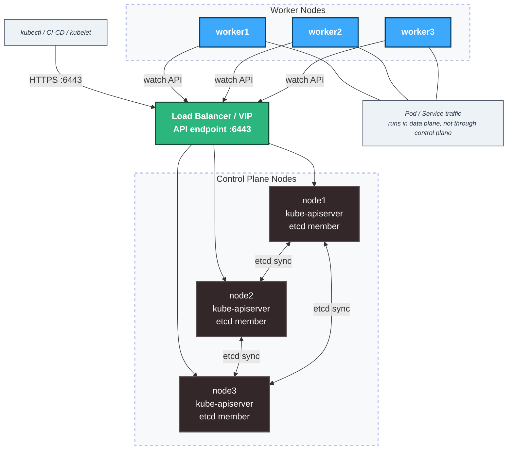

# AWS Kubernetes Platform — Terraform + Ansible

Tự động hóa toàn bộ quá trình dựng cụm Kubernetes High Availability trên AWS: từ cấp phát hạ tầng bằng Terraform đến cài đặt và cấu hình cluster bằng Ansible — không cần SSH thủ công vào từng máy.

   

---

## Tổng quan

Thay vì vào AWS Console tạo từng EC2, rồi SSH vào từng máy cài Docker, cài kubeadm, init cluster, copy join token sang worker... dự án này rút gọn toàn bộ quy trình đó xuống còn một vài lệnh:

```bash
terraform apply          # cấp phát hạ tầng + tự sinh inventory.ini
ansible-playbook ...     # cài đặt và cấu hình toàn bộ cluster
```

Kết quả: cụm K8s 3 node (1 control plane + 2 worker) với đầy đủ Ingress, Metrics Server và monitoring stack — trong khoảng 10–20 phút.


---
## Yêu cầu

- AWS account + aws configure (AWS Access Key ID, AWS Secret Access Key, Default region name, Default output format)
- SSH key tại `~/sshkeyaws` (hoặc đổi path trong `inventory.ini`)
- Terraform >= 1.0
- Ansible >= 2.12

---

## Cách chạy

```bash
# 1. Provision hạ tầng AWS và sinh inventory
terraform init
terraform apply
# Sau bước này inventory.ini được tạo tự động trong ansible-lab/

# 2. Cài Kubernetes lên tất cả nodes
ansible-playbook -i ansible-lab/inventory.ini ansible-lab/playbook1_InstallK8s.yaml

# 3. Init control plane và join workers
ansible-playbook -i ansible-lab/inventory.ini ansible-lab/playbook2_k8s_init.yml

# 4. Cài addons (Ingress, Metrics Server, Monitoring)
ansible-playbook -i ansible-lab/inventory.ini ansible-lab/playbook3_k8s_addons.yaml

# 5. Cài Docker và Nginx (optional)
ansible-playbook -i ansible-lab/inventory.ini ansible-lab/playbook4_InstallDocker.yaml
ansible-playbook -i ansible-lab/inventory.ini ansible-lab/playbook5_InstallNginx.yaml

# 6. Verify
cd ansible-lab
ansible control_plane -a "kubectl get nodes" -i inventory.ini
ansible control_plane -a "kubectl get pods -A" -i inventory.ini
ansible control_plane -a "kubectl get ingress" -i inventory.ini
```

---


## Kiến trúc

```
terraform apply
    │
    ├── VPC, Security Groups, EC2 x6, Network Load Balancer
    │
    └── outputs.tf ──► inventory.ini
                            │
                ┌───────────┴───────────┐
                │    5 Ansible Playbooks │
                └───────────────────────┘
                    │
                    ├── playbook1: Cài Kubernetes
                    │       └── kubeadm, kubelet, kubectl (cả 6 node)
                    │
                    ├── playbook2: Init HA cluster + join control plane + join worker
                    │       ├── kubeadm init --control-plane-endpoint=<NLB DNS>:6443 --upload-certs
                    │       ├── kubeadm join --control-plane (node2, node3)
                    │       └── kubeadm join (worker1, worker2, worker3)
                    │
                    ├── playbook3: Cài Kubernetes addons & Monitoring
                    │       ├── Nginx Ingress Controller
                    │       ├── Metrics Server
                    │       └── Prometheus + Grafana
                    │           (kube-prometheus-stack)
                    │
                    ├── playbook4: Cài đặt Docker
                    │       └── Docker Engine, Docker CLI
                    │
                    └── playbook5: Cài đặt Nginx


```

---

## Cấu trúc thư mục

```
├── main.tf                         #  security groups, Network Load Balancer
├── ec2.tf                          # Các ec2 instance
├── variables.tf
├── outputs.tf                      # DNS name của Load Balancer, IP từng node
├── provider.tf
├── local_resources.tf              # Tự động sinh inventory.ini (control_plane, workers, loadbalancer)
│
└── ansible-lab/
    ├── inventory.ini               # Auto-generated bởi Terraform, không edit tay
    ├── playbook1_InstallK8s.yaml   # Cài kubeadm, kubelet, kubectl lên tất cả nodes
    ├── playbook2_k8s_init.yml      # Init HA control plane + upload-certs + join CP + join worker
    ├── playbook3_k8s_addons.yaml   # Nginx Ingress Controller, Metrics Server, Monitoring
    ├── playbook4_InstallDocker.yaml
    ├── playbook5_InstallNginx.yaml
    └── roles/
        ├── k8s_install/
        ├── role3-DockerInstall/
        └── setup-monitoring/       # kube-prometheus-stack
```

---

## Điểm thiết kế đáng chú ý

**Terraform tự sinh Ansible inventory**

local_resources.tf lấy IP của từng EC2 và DNS name của Network Load Balancer, ghi thẳng vào inventory.ini. Tear down rồi provision lại, inventory tự cập nhật — không lo nhầm IP hay quên cập nhật endpoint API server.

Ansible inventory output mẫu:
```
[control_plane]
node1 ansible_host=xxx.xxx.xxx.xxx private_ip=172.31.46.179
node2 ansible_host=xxx.xxx.xxx.xxx private_ip=172.31.39.155
node3 ansible_host=xxx.xxx.xxx.xxx private_ip=172.31.19.92

[workers]
worker1 ansible_host=xxx.xxx.xxx.xxx private_ip=172.31.34.23
worker2 ansible_host=xxx.xxx.xxx.xxx private_ip=172.31.23.196
worker3 ansible_host=xxx.xxx.xxx.xxx private_ip=172.31.38.81

[k8s_cluster:children]
control_plane
workers

[loadbalancer]
loadbalancer_api ansible_host=main-lb-8c6cc251316e7649.elb.ap-southeast-1.amazonaws.com

[all:vars]
ansible_user=ubuntu
ansible_ssh_private_key_file=~/sshkeyaws
ansible_ssh_common_args='-o StrictHostKeyChecking=no'
ansible_python_interpreter=/usr/bin/python3

```
Group ```[loadbalancer]``` không phải là node Ansible sẽ SSH vào để cài đặt gì — nó là một biến tham chiếu, dùng để inject DNS name của NLB vào ```--control-plane-endpoint``` lúc ```kubeadm init```, và vào kubeconfig của client.

**Network Load Balancer là điểm vào duy nhất cho API server**
Thay vì kubectl client hay worker node trỏ thẳng vào IP của một control plane cụ thể (rủi ro nếu node đó chết), mọi traffic tới API server (port 6443) đều đi qua NLB, NLB forward tới target group gồm cả 3 control plane node. ```kubeadm init``` dùng ```--control-plane-endpoint=<NLB DNS>:6443``` ngay từ đầu để toàn bộ chứng chỉ TLS và cấu hình cluster đều build quanh địa chỉ ổn định này, không phải IP của riêng node1.

***etcd chạy dạng stacked, 3 node để giữ quorum**
Với kubeadm, mặc định mỗi control plane node chạy etcd ngay tại chỗ (stacked topology) thay vì etcd cụm riêng (external). 3 là số node tối thiểu để etcd duy trì quorum — cluster chịu được 1 control plane chết mà vẫn đọc/ghi state, schedule pod bình thường.

**Join control plane khác về bản chất so với join worker**
playbook2 khởi tạo cụm k8s: node đầu tiên chạy kubeadm init --upload-certs để sinh certificate key dùng chung; node2, node3 dùng kubeadm join --control-plane kèm certificate key đó (không phải token worker thông thường) để trở thành control plane thực sự — có etcd, có API server riêng — chứ không phải chỉ join như một worker.

**Tách playbook theo từng bước**

5 playbook độc lập thay vì một file lớn. Lý do thực tế: khi debug có thể re-run đúng bước bị lỗi mà không chạy lại toàn bộ. Ví dụ nếu playbook3 (addons) lỗi, không cần init lại cluster từ đầu.

**Dùng kubeadm thay vì EKS**

EKS che đi toàn bộ phần HA control plane, etcd, load balancer..., AWS tự quản lý hết. Dùng kubeadm để tự tay dựng phần HA này giúp hiểu rõ control plane components, etcd quorum, certificate key flow giữa các control plane, và cách load balancer health check ảnh hưởng tới quá trình join — những thứ bắt buộc phải nắm khi vận hành cluster production thật.


---


## Kết quả

Sau khi chạy xong:

```
NAME               STATUS   ROLES           AGE     VERSION
ip-172-31-19-92    Ready    control-plane   40s     v1.30.14
ip-172-31-23-196   Ready    <none>          15s     v1.30.14
ip-172-31-34-23    Ready    <none>          16s     v1.30.14
ip-172-31-38-81    Ready    <none>          16s     v1.30.14
ip-172-31-39-155   Ready    control-plane   40s     v1.30.14
ip-172-31-46-179   Ready    control-plane   3m51s   v1.30.14

```
Các pods đang chạy:
```
ansible control_plane[0] -a "kubectl get pods -A" -i inventory.ini

control_plane | CHANGED | rc=0 >>
NAMESPACE       NAME                                                     READY   STATUS    RESTARTS   AGE
default         alertmanager-monitoring-kube-prometheus-alertmanager-0   2/2     Running   0          54m
default         monitoring-grafana-5465f97769-bvvbf                      3/3     Running   0          54m
default         monitoring-kube-prometheus-operator-86d948958c-dg9r6     1/1     Running   0          54m
default         monitoring-kube-state-metrics-99d68447-fxx7t             1/1     Running   0          54m
default         monitoring-prometheus-node-exporter-5tm6m                1/1     Running   0          54m
default         monitoring-prometheus-node-exporter-5zpgw                1/1     Running   0          54m
default         monitoring-prometheus-node-exporter-qvw2v                1/1     Running   0          54m
default         prometheus-monitoring-kube-prometheus-prometheus-0       2/2     Running   0          54m
ingress-nginx   ingress-nginx-controller-556945c8b6-mhzvp                1/1     Running   0          55m
kube-system     calico-kube-controllers-564985c589-rkzcm                 1/1     Running   0          58m
kube-system     calico-node-49cp8                                        1/1     Running   0          58m
kube-system     calico-node-jp7jm                                        1/1     Running   0          58m
kube-system     calico-node-plwv4                                        1/1     Running   0          58m
kube-system     coredns-55cb58b774-bfn9r                                 1/1     Running   0          58m
kube-system     coredns-55cb58b774-bvrhl                                 1/1     Running   0          58m
kube-system     etcd-ip-172-31-39-95                                     1/1     Running   0          59m
kube-system     kube-apiserver-ip-172-31-39-95                           1/1     Running   0          59m
kube-system     kube-controller-manager-ip-172-31-39-95                  1/1     Running   0          59m
kube-system     kube-proxy-8j5pt                                         1/1     Running   0          58m
kube-system     kube-proxy-hjms5                                         1/1     Running   0          58m
kube-system     kube-proxy-jjndd                                         1/1     Running   0          58m
kube-system     kube-scheduler-ip-172-31-39-95                           1/1     Running   0          59m
kube-system     metrics-server-65d5d6f74d-2jpjn                          1/1     Running   0          55m

```


Grafana và Prometheus accessible qua Nginx Ingress. HPA hoạt động nhờ Metrics Server.
```bash
ansible control_plane[0] -a "kubectl get ingress" -i inventory.ini

node1 | CHANGED | rc=0 >>
NAME                   CLASS   HOSTS                                                                                                 ADDRESS         PORTS   AGE
alertmanager-ingress   nginx   alertmanager.172.31.32.33.nip.io,alertmanager.172.31.31.56.nip.io,alertmanager.172.31.40.223.nip.io   172.31.40.223   80      49s
grafana-ingress        nginx   grafana.172.31.32.33.nip.io,grafana.172.31.31.56.nip.io,grafana.172.31.40.223.nip.io                  172.31.40.223   80      49s
prometheus-ingress     nginx   prometheus.172.31.32.33.nip.io,prometheus.172.31.31.56.nip.io,prometheus.172.31.40.223.nip.io         172.31.40.223   80      49s

```


Xem cổng ingress được mở và curl qua hosts:
```
ansible control_plane -a "kubectl get svc -n ingress-nginx" -i inventory.ini

node1 | CHANGED | rc=0 >>
NAME                                 TYPE        CLUSTER-IP       EXTERNAL-IP   PORT(S)                      AGE
ingress-nginx-controller             NodePort    10.101.212.160   <none>        80:32080/TCP,443:32443/TCP   42m
ingress-nginx-controller-admission   ClusterIP   10.97.62.72      <none>        443/TCP                      42m

```


```
ansible control_plane[0] -a "curl -I http:// grafana.172.31.32.33.nip.io:32080" -i inventory.ini

node1 | CHANGED | rc=0 >>
HTTP/1.1 302 Found
Date: Fri, 05 Jun 2026 15:29:02 GMT
Content-Type: text/html; charset=utf-8
Connection: keep-alive
Cache-Control: no-store
Location: /login
X-Content-Type-Options: nosniff
X-Frame-Options: deny
X-Xss-Protection: 1; mode=block
```
---

## Dọn dẹp

```bash
terraform destroy
```